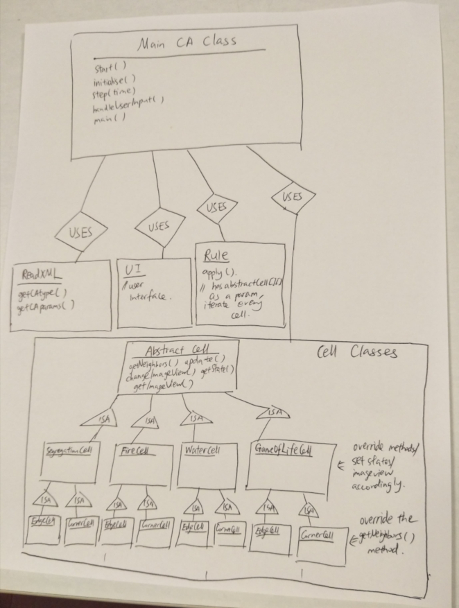

CompSci 308: Cell Society Analysis
===================

This is the link to the assignment: [Cell Society](http://www.cs.duke.edu/courses/compsci308/current/assign/02_cellsociety/)

This is the link to my team's project: [team 13](https://coursework.cs.duke.edu/CompSci308_2018Fall/cellsociety_team13)


Design Review
=======

### Overall Design
Reflect on the coding details of the entire project by reading over all the code.


* Description of the overall design
    1. Simulation is done by using a pair of Rule and Cell classes to represent the logic that determines the changing of states for each cell at each step. Further, simulations are represented in a two-dimensional array that stores all the Cell objects, regardless of what kind of cell shapes, grid types, grid panel dimensions that the user chooses. Visualization is done by the main UIManager class and the GridUI class that constantly looks at the underlying simulation classes to determine what to show to the user. Configuration is done by the other classes such as ReadXML and some UI classes such as UIManager. This is a weakness of the project because configuration is not clearly separated from visualization.
        * Simulation: Manage the cells and rules that determine the update of cells' states
        * Visualization: Display the JavaFx objects corresponding to the cells and the different panels
        * Configuration: Control the reading and configuration of initial states
    2. The user needs to write one additional Rule and one additional Cell classes for that simulation. The cell and the rule classes need to implement the abstract methods defined by the abstract Cell and Rule classes. Beside that, the Rule class needs to make sure that it reads the list of extra parameters specified by the new XML. For now, our project is not capable of constructing a new kind of Cell or a new kind of Rule solely based on a read-in XML. The user has to manually add in the classes.
    3. Dependency is mostly fine in the whole project, except one very static method showWarningPopup in UIManager that manages the pop-up of error messages when an exception happens. Different classes call this static method throughout the place. In the future, there should be a separate exception handling package of classes. Also though there is not a lot of back channel access, setters and getters are used throughout the project, especially when subclasses try to access instance variables of superclasses.
* Analysis of one component not implemented by me (ReadXML)
    1. This class is very readable, because the comments for the class and the methods tell exactly what they do. It takes a File object as an input and outputs the various parameters necessary for the simulation to run.
        ```java
        /**
         * Read in initial state for each cell and update the 2D array cellState.
         */
        private void readState() {
            try {
                NodeList typeList = document.getElementsByTagName("cellState");
                String dataType = typeList.item(0).getAttributes().getNamedItem("dataType").getNodeValue();
                if (dataType.equals("list")) {
                    readStateList();
                } else if (dataType.equals("ratio")) {
                    readStateRatio();
                } else if (dataType.equals("random")) {
                    readStateRandom();
                }
            }
            catch (Exception e){
                UIManager.showWarningPopup(XMLFileCellStateException);
            }
        }
        ```

        This class reads the initial states of the cells depending on what kind that the grid data is specified by the XML, choosing between "ratio", "random" and "list". The error handling is easy to follow too.
     2. It is definitely encapsulated, though adding new features to the class necessarily requires some changes in other classes according to the current hierarchy. Adding a new feature, for example, to the XML format requires the user to add a parsing method and one getter method to ReadXML. However, one must add some other logic to other files, especially UIManager, so that the project recognizes these new parameters and make use of those new parameters. On the other hand, since it is conceptually clearly removed from the other classes, adding new features to this class will not affect any of the rest classes.
     3. The methods' names are clear and concise and the ordering of these methods makes logical sense. ReadXML handles the exceptions completely in this class. This can be good and bad thing at the same time. Conceptually it seems that any error with XML parsing should be handled by an XML parser before the exception is passed to other classes in the call stack. However, my teammate lost the chance to practice using "throws" keywords. I feel the teammate should write more helper methods that refactor the repetitive code in different core methods such as readxxx, getxxx (part of its public API).
* Layout, naming conventions and descriptiveness, and style
    1. The naming conventions are generally consistent. The abstract classes and the inheritance hierarchy ensures different classes have consistent naming conventions as well. This is a Rule class written by me,
        ```java
        package rule;

        import cell.Cell;
        import cell.GameOfLifeCell;
        import simulation.Grid;

        import java.util.List;

        /**
         * @author Haotian Wang
         * A specific Rule class for GameOfLife game, adapting from https://en.wikipedia.org/wiki/Conway's_Game_of_Life#Rules.
         */
        public class GameOfLifeRule extends Rule {
            private final int UNDERPOPULATION_THRESHOLD;
            private final int OVERPOPULATION_THRESHOLD;

            public GameOfLifeRule(Grid grid, List<Double> extraParameters) {
                super(grid, extraParameters);
                UNDERPOPULATION_THRESHOLD = (int) Math.floor(extraParameters.get(0));
                OVERPOPULATION_THRESHOLD = (int) Math.floor(extraParameters.get(1));
                this.getStateMap().put(GameOfLifeCell.ALIVE, "ALIVE");
                this.getStateMap().put(GameOfLifeCell.DEAD, "DEAD");
            }

            @Override
            public void determineNextStates() {
                for (int i = 0; i < this.getGrid().getNumRow(); i++) {
                    for (int j = 0; j < this.getGrid().getNumCol(); j++) {
                        Cell cell = this.getGrid().item(i, j);
                        List<Cell> neighbors = getGrid().getAllNeighbors(i, j);
                        checkCell(cell, neighbors);
                    }
                }
            }

            private void checkCell(Cell cell, List<Cell> neighbors){
                int numAliveNeighbors = 0;
                for (Cell neighbor : neighbors) {
                    if (neighbor != null && neighbor.getState() == GameOfLifeCell.ALIVE) {
                        numAliveNeighbors++;
                    }
                }
                if (cell.getState() == GameOfLifeCell.DEAD && numAliveNeighbors == OVERPOPULATION_THRESHOLD) {
                    cell.setNextState(GameOfLifeCell.ALIVE);
                } else if (cell.getState() == GameOfLifeCell.ALIVE &&
                        (numAliveNeighbors < UNDERPOPULATION_THRESHOLD || numAliveNeighbors > OVERPOPULATION_THRESHOLD)) {
                    cell.setNextState(GameOfLifeCell.DEAD);
                } else {
                    cell.setNextState(cell.getState());
                }
            }
        }
        ```
        This is a Rule class written by Yunhao,
        ```java
        package rule;


        import cell.Cell;
        import cell.SpreadingOfFireCell;
        import simulation.Grid;

        import java.util.List;

        /**
         * @author Yunhao Qing
         * A specific Rule class for SpreadingOfFire game,
         * adapting rules from http://nifty.stanford.edu/2007/shiflet-fire/.
         */
        public class SpreadingOfFireRule extends Rule {
            private final int MY_BURNING_COUNT;
            private final double PROB_GROWTH;
            private final double PROB_CATCH;

            /**
             * Constructor for SpreadingOfFireRule.
             * @param grid the grid with states number in each cell
             * @param extraParameters MY_BURNING_COUNT, PROB_GROWTH and PROB_CATCH
             */
            public SpreadingOfFireRule(Grid grid, List<Double> extraParameters) {
                super(grid, extraParameters);
                PROB_CATCH = extraParameters.get(0);
                PROB_GROWTH = extraParameters.get(1);
                MY_BURNING_COUNT = (int) Math.floor(extraParameters.get(2));
                this.getStateMap().put(SpreadingOfFireCell.NORMAL, "NORMAL");
                this.getStateMap().put(SpreadingOfFireCell.BURNING, "BURNING");
                this.getStateMap().put(SpreadingOfFireCell.EMPTY, "EMPTY");
            }

            private void determineNextStatesBurning(SpreadingOfFireCell cell) {
                cell.setBurningTime(cell.getBurningTime() + 1);
                if (cell.getBurningTime() == MY_BURNING_COUNT) {
                    cell.setBurningTime(0);
                    cell.setNextState(SpreadingOfFireCell.EMPTY);
                } else {
                    cell.setNextState(cell.getState());
                }
            }

            private void determineNextStatesNormal(Cell cell, List<Cell> neighbors){
                boolean check = false;
                for (Cell neighbor : neighbors) {
                    if (neighbor != null && neighbor.getState() == SpreadingOfFireCell.BURNING) {
                        check = true;
                    }
                }
                if (check && rand.nextDouble() < PROB_CATCH) {
                    cell.setNextState(SpreadingOfFireCell.BURNING);
                } else {
                    cell.setNextState(cell.getState());
                }
            }

            private void determineNextStatesEmpty(SpreadingOfFireCell cell) {
                if (rand.nextDouble() < PROB_GROWTH){
                    cell.setNextState(SpreadingOfFireCell.NORMAL);
                } else {
                    cell.setNextState(cell.getState());
                }
            }

            /**
             * Transver the grid and determine the next state for each cell.
             */
            @Override
            public void determineNextStates() {
                for (int i = 0; i < this.getGrid().getNumRow(); i++) {
                    for (int j = 0; j < this.getGrid().getNumCol(); j++) {
                        SpreadingOfFireCell cell = (SpreadingOfFireCell) this.getGrid().item(i, j);
                        if (cell.getState() == SpreadingOfFireCell.BURNING) {
                            determineNextStatesBurning(cell);
                        }
                        else if (cell.getState() == SpreadingOfFireCell.NORMAL) {
                            List<Cell> neighbors = getGrid().getDirectNeighbors(i, j);
                            determineNextStatesNormal(cell, neighbors);
                        }
                        else if (cell.getState() == SpreadingOfFireCell.EMPTY) {
                            determineNextStatesEmpty(cell);
                        }
                    }
                }
            }
        }
        ```
        The naming conventions are the same because they reflect the inheritance hierarchy.
    2. However descriptiveness is lacking because we did not document what each class did in the Java files, instead of on messenger group chat. For example, this class written by me,
        ```java
        /**
         * @author Haotian Wang
         * This abstract class handles the change of appearances of nodes. It initializes and updates Shape or ImageView of the various cells in the 2D array of the Grid class. Whether the cells will have a Shape or an ImageView depends on the specifications in UI_graphic.properties file.
         */
        public abstract class GridUI {
            private ResourceBundle myCellResources;
            private final static Map<String, Paint> stringToPaintMap;
            static {
                Map<String, Paint> aMap = new HashMap<>();
                aMap.put("White", Color.WHITE);
                aMap.put("Blue", Color.BLUE);
                aMap.put("Red", Color.RED);
                aMap.put("Green", Color.GREEN);
                aMap.put("Yellow", Color.YELLOW);
                aMap.put("Azure", Color.AZURE);
                aMap.put("Gold", Color.GOLD);
                aMap.put("Cyan", Color.CYAN);
                aMap.put("Gray", Color.GRAY);
                aMap.put("Lime", Color.LIME);
                aMap.put("Magenta", Color.MAGENTA);
                aMap.put("Pink", Color.PINK);
                aMap.put("Black", Color.BLACK);
                stringToPaintMap = Collections.unmodifiableMap(aMap);
            }
         ```
### Your Design
Reflect on the coding details of your part of the project.
* High level design

    I worked on different parts in the first week and the second week.
    * In the first week, I worked on Cell and Rule classes and wrote one or two simple Cell and Rule implementations for the abstract classes for my teammates to understand my hierarchy better. The family of Rule classes has methods that update the various states, parameters of cells. The family of Cell classes has very simple methods such as updating its current state to next state, which is determined by the Rule class. Moreover, in the first week, the underlying cell logic was not separate from the JavaFx nodes representing those cells. Therefore, the Cells had to interact with the UI classes as well, in the sense that the UI classes called the Rule classes, which called the Cell classes to update the appearances of these cells in the JavaFx panes.
    * In the second week, I redesign the architecture so that the components that managed the image aspects of the cells are separated from the Cell classes themselves. The Rule classes also no longer dealt with the update of appearances. So I mainly wrote the Grid, GridUI, Rule, Cell classes. Rule classes are constructed in the UIManager class. In each Rule, a Grid is constructed. Each Grid initializes the number of Cell classes specified by the user XML. Rule applies logic to the cells through the middle man Grid, because most importantly the methods of getting neighbors are different for different cells but Rule needs to call the same method called "getNeighbors". Grid handles exactly that. GridUI handles the updating of appearances of the various cells contained in the Grid of Cells.

* Design checklist issues
    * Communication
        1. The names of the classes and methods reveal clearly the intention of the methods or the classes. However, methods such as "updateGrid" of Rule are not very revealing in terms of naming convention.
            ```java
            /**
             * Update all the Cells in the grid to their next states.
             */
            public void updateGrid() {
                for (int i = 0; i < this.getGrid().getNumRow(); i++) {
                    for (int j = 0; j < this.getGrid().getNumCol(); j++) {
                        this.getGrid().item(i, j).updateToNextState();
                        this.getGrid().item(i, j).setNextState(Cell.UNINITIALIZED);
                    }
                }
            }
            ```
            The method should be called "updateCellsInGridToNextStates" instead. The method name may mislead the user into thinking that the method updates the appearances of cells instead. The following contains bad names,
            ```java
            /**
             * A method used to find the neighbors of a cell in a grid.
             * @param row: the row number of the cell whose neighbors are to be found.
             * @param col: the column number of the cell whose neighbors are to be found.
             * @return A List of Cell that contains the neighbors of the cell passed as parameter.+     */
            public List<Cell> getAllNeighbors(int row, int col) {
                return callGetNeighborsByType("All", row, col);
            }

            /**
             * @return neighbors a list that consists of direct neighbours (up, down,
             * left, right) that are within the grid.
             */
            public List<Cell> getDirectNeighbors(int row, int col) {
                return callGetNeighborsByType("Direct", row, col);
            }

            /**
             *
             * @param neighborType
             * @param row
             * @param col
             * @return
             */
            private List<Cell> callGetNeighborsByType(String neighborType, int row, int col) {
                try {
                    Method method = getClass().getMethod("get" + neighborType +"Neighbors" + myCellshape, int.class, int.class);
                    Object ret = method.invoke(this, row, col);
                    return (List<Cell>) ret;
                } catch (SecurityException e) {
                    UIManager.showWarningPopup(e.getMessage() + "\n" + myTextResources.getString("SecurityText"));
                } catch (IllegalArgumentException e) {
                    UIManager.showWarningPopup(e.getMessage() + "\n" + myTextResources.getString("IllegalArgumentText"));
                } catch (NoSuchMethodException e) {
                    UIManager.showWarningPopup(e.getMessage() + "\n" + myTextResources.getString("NoSuchMethodText"));
                } catch (IllegalAccessException e) {
                    UIManager.showWarningPopup(e.getMessage() + "\n" + myTextResources.getString("IllegalAccessText"));
                } catch (InvocationTargetException e) {
                    UIManager.showWarningPopup(e.getMessage() + "\n" + myTextResources.getString("InvocationTargetText"));
                }

                return null;
            }
            ```
            These methods actually use reflection to solve the problem of getNeighbors, for different simulations, but they are not conducive to future development by maintainers.
        2. There are no magic values.
        3. I did not use in-line comments in my classes.
        4. Variables are declared close to where they are used. However there is one problem. A lot of the static instance variables of Cell are indeed declared in the various Cell classes. However, GridUI and Grid has to frequently make use of those variables, which results in a lot of setter and getter methods. However it does not make sense to define properties of Cells in Grid or GridUI as well.
        5. I failed to implement known Java APIs. The code was basically written from scratch. This is a place that I should improve on in the future.
        6. Java compiler does not report warnings.
    * Modularity
        1. I avoided public instance variables except public static final variables that have to be used in many different places. For example,
            ```java
            package cell;

            /**
             * @author Haotian Wang
             * A cell class for Game of Life Simulation.
             */
            public class GameOfLifeCell extends Cell {
                public static final int DEAD = 0;
                public static final int ALIVE = 1;

                public GameOfLifeCell(int state, int i, int j) {
                    super(state, i, j);
                }
            }
            ```
            The DEAD and ALIVE int values are used in many different classes.
         2. The static variables can be avoided by better streamlining these states between different classes.
         3. Tell, don't ask: Rule calls Cells to call their own methods when the rule tries to change the sates of the cells.
            ```java
            @Override
                public void determineNextStates() {
                    for (int i = 0; i < this.getGrid().getNumRow(); i++) {
                        for (int j = 0; j < this.getGrid().getNumCol(); j++) {
                            Cell cell = this.getGrid().item(i, j);
                            List<Cell> neighbors = getGrid().getAllNeighbors(i, j);
                            checkCell(cell, neighbors);
                        }
                    }
                }

                private void checkCell(Cell cell, List<Cell> neighbors){
                    int numAliveNeighbors = 0;
                    for (Cell neighbor : neighbors) {
                        if (neighbor != null && neighbor.getState() == GameOfLifeCell.ALIVE) {
                            numAliveNeighbors++;
                        }
                    }
                    if (cell.getState() == GameOfLifeCell.DEAD && numAliveNeighbors == OVERPOPULATION_THRESHOLD) {
                        cell.setNextState(GameOfLifeCell.ALIVE);
                    } else if (cell.getState() == GameOfLifeCell.ALIVE &&
                            (numAliveNeighbors < UNDERPOPULATION_THRESHOLD || numAliveNeighbors > OVERPOPULATION_THRESHOLD)) {
                        cell.setNextState(GameOfLifeCell.DEAD);
                    } else {
                        cell.setNextState(cell.getState());
                    }
                }
            ```
         4. Superclasses do not overstretch into the boundaries of subclasses.
            ```java
            /**
             * @author Haotian Wang
             * An abstract class that defines the rules for updating the states of cells in a grid. Determine what the next states
             */
            public abstract class Rule {

                public final static Random rand = new Random();
                private Grid myGrid;
                private Map<Integer,String> myStateMap = new HashMap<>();
            ```

    * Flexibility
        1. There is little repetitive code.
            ```java
            private List<Cell> callGetNeighborsByType(String neighborType, int row, int col) {
                try {
                    Method method = getClass().getMethod("get" + neighborType +"Neighbors" + myCellshape, int.class, int.class);
                    Object ret = method.invoke(this, row, col);
                    return (List<Cell>) ret;
                } catch (SecurityException e) {
                    UIManager.showWarningPopup(e.getMessage() + "\n" + myTextResources.getString("SecurityText"));
                } catch (IllegalArgumentException e) {
                    UIManager.showWarningPopup(e.getMessage() + "\n" + myTextResources.getString("IllegalArgumentText"));
                } catch (NoSuchMethodException e) {
                    UIManager.showWarningPopup(e.getMessage() + "\n" + myTextResources.getString("NoSuchMethodText"));
                } catch (IllegalAccessException e) {
                    UIManager.showWarningPopup(e.getMessage() + "\n" + myTextResources.getString("IllegalAccessText"));
                } catch (InvocationTargetException e) {
                    UIManager.showWarningPopup(e.getMessage() + "\n" + myTextResources.getString("InvocationTargetText"));
                }

                return null;
            }
             ```
             This piece of reflection code is used in multiple places, but to remove this duplicate is hard, because different method invocations and class constructors take in different parameters.
        2. Interfaces and abstract classes are used in much as possible instead of concrete classes.
            ```java
            public void updateAppearance() {
                for (int i = 0; i < myGrid.getNumRow(); i++) {
                    for (int j = 0 ; j < myGrid.getNumCol(); j++) {
                        Node node = myNodes.get(i * myGrid.getNumCol() + j);
                        double opacity = myGrid.item(i, j).getOpacity();
                        int state = myGrid.item(i, j).getState();
                        if (node instanceof Shape) {
                            ((Shape) node).setFill(intToPaintMap.get(state));
                            node.setOpacity(opacity);
                        }
                        else if (node instanceof ImageView) {
                            ((ImageView) node).setImage(intToImageMap.get(state));
                        }
                    }
                }
            }
            ```
            This method takes in the general JavaFx node and applies different logic depending on whether the Node is a Shape or an ImageView.
* Description of two features
    * Good feature: The different Rule classes can call getAllNeighbors or getDirectNeighbors directly that belong to the Grid class without worrying about cell shapes (square, triangle, hexagon) or grid types (finite and toroidal). It makes sense because essentially the Rule classes are developed by different team members, and remove from them the need to worry about how "neighbors" are defined for different configurations.
    * Bad feature: Very related to the good feature, the GridUI classes, in contrast, are hard to extend or even understand, even by myself.
        ```java
        package UI;

        import javafx.scene.Node;
        import javafx.scene.image.ImageView;
        import javafx.scene.shape.Polygon;
        import simulation.Grid;

        import java.util.ResourceBundle;

        /**
         * @author Haotian Wang
         * A GridUI subclass that implements a grid of hexangonal cells.
         */
        public class GridUIHexagon extends GridUI {
            private double cellWidth;
            private double cellHeight;
            private double edge;

            public GridUIHexagon(Grid grid, ResourceBundle resource) {
                super(grid, resource);
            }

            @Override
            protected void calculateLengths() {
                cellHeight = getSimulationHeight() / (getMyGrid().getNumRow() + 1);
                edge = cellHeight / 2 / Math.sqrt(3);
                cellWidth = (getSimulationWidth() - edge) / getMyGrid().getNumCol() - edge;
            }

            @Override
            protected void addShape(int i, int j, int state) {
                Node temp = new Polygon();

                if (j % 2 == 0) {
                    ((Polygon) temp).getPoints().addAll(new Double[] {
                            edge + j * (cellWidth + edge), i * cellHeight,
                            edge + j * (cellWidth + edge) + cellWidth, i * cellHeight,
                            edge + j * (cellWidth + edge) + cellWidth + edge, i * cellHeight + cellHeight / 2,
                            edge + j * (cellWidth + edge) + cellWidth, i * cellHeight + cellHeight,
                            edge + j * (cellWidth + edge), i * cellHeight + cellHeight,
                            edge + j * (cellWidth + edge) - edge, i * cellHeight + cellHeight / 2,
                    });
                }
                else if (j % 2 == 1) {
                    ((Polygon) temp).getPoints().addAll(new Double[] {
                            edge + j * (cellWidth + edge), i * cellHeight + cellHeight / 2,
                            edge + j * (cellWidth + edge) + cellWidth, i * cellHeight + cellHeight / 2,
                            edge + j * (cellWidth + edge) + cellWidth + edge, i * cellHeight + cellHeight,
                            edge + j * (cellWidth + edge) + cellWidth, i * cellHeight + cellHeight * 3 / 2,
                            edge + j * (cellWidth + edge), i * cellHeight + cellHeight * 3 / 2,
                            edge + j * (cellWidth + edge) - edge, i * cellHeight + cellHeight,
                    });
                }
                ((Polygon) temp).setFill(getIntToPaintMap().get(state));
                getMyNodes().add(temp);
            }

            @Override
            protected void addImageView(int i, int j, int state) {
                Node temp = new ImageView(getIntToImageMap().get(state));
                ((ImageView) temp).setX(0.5 * edge + j * (cellWidth + edge));
                if (j % 2 == 0) {
                    ((ImageView) temp).setY(i * cellHeight + cellHeight / 4);
                }
                else if (j % 2 == 1) {
                    ((ImageView) temp).setY(i * cellHeight + 0.75 * cellHeight);
                }
                ((ImageView) temp).setFitWidth(cellHeight + edge);
                ((ImageView) temp).setFitHeight(0.5 * cellHeight);
                getMyNodes().add(temp);
            }
        }
        ```
        Take for example this GridUI class for Hexagon. Though the logic for accessing the neighbors is smartly determined, the logic that displays the cells onto the screen is hard coded in an ugly manner. Debugging requires the user to look at multiple classes because error handling is hard to implement in this hard-coded class as well. I have not come up with a smart solution to this problem.


### Flexibility
Reflect on what makes a design flexible and extensible.
* Flexible design
    * Strength
        * Different simulations use a pair of Rule and Cell classes that extend the abstract Rule and Cell classes. The developer only needs to worry about following the format of XML specification and implementing the abstract methods in the superclass. The developer is provided with access to the Cells in a Grid and two getNeighbor methods that support different types of cell shapes and grids. He has to worry little about the visualization part except that the user has to make sure the number of states that a cell can take.
        * Even the Cell in some simulations contains extra parameters other than the states that determine directly the appearance of cells. For example, the game of life simulation may have underpopulation and overpopulation threshold. However a developer does not have to worry about reading XML these new parameters. Instead, in the Rule class, the developer can just read the list of extra parameters that are defined in XML and handled by ReadXML automatically. For example,
            ```java
            public SpreadingOfFireRule(Grid grid, List<Double> extraParameters) {
                    super(grid, extraParameters);
                    PROB_CATCH = extraParameters.get(0);
                    PROB_GROWTH = extraParameters.get(1);
                    MY_BURNING_COUNT = (int) Math.floor(extraParameters.get(2));
            }
            ```

            The "extraParameters.get()" handles the extra parameters. This follows the dry code principle.
    * Weakness
        * To add a new kind of cell shape, the developer has to add several neighbor traversing mechanisms into Grid like the following,
            ```java
            private static final int[][] SQUARE_DIRECT = new int[][] {{1, 0}, {-1, 0}, {0, 1}, {0, -1}};
            private static final int[][] SQUARE_ALL = new int[][] {{1, 0}, {-1, 0}, {0, 1}, {0, -1}, {1, 1}, {1, -1}, {-1, 1}, {-1,-1}};
            private static final int[][] HEXAGON_EVEN = new int[][] {{-1, 0}, {1, 0}, {0, -1}, {0, 1}, {-1, -1}, {-1, 1}};
            private static final int[][] HEXAGON_ODD = new int[][] {{-1, 0}, {1, 0}, {0, -1}, {0, 1}, {1, -1}, {1, 1}};
            private static final int[][] TRIANGLE_DIRECT_EVEN = new int[][] {{0, -1}, {0, 1}, {-1, 0}};
            private static final int[][] TRIANGLE_DIRECT_ODD = new int[][] {{0, -1}, {0, 1}, {1, 0}};
            private static final int[][] TRIANGLE_ALL_EVEN = new int[][] {{-1, -1}, {-1, 0}, {-1, 1}, {0, -2}, {0, -1}, {0, 1}, {0, 2}, {1, -2}, {1, -1}, {1, 0}, {1, 1}, {1, 2}};
            private static final int[][] TRIANGLE_ALL_ODD = new int[][] {{-1, -2}, {-1, -1}, {-1, 0}, {-1, 1}, {-1, 2}, {0, -2}, {0, -1}, {0, 1}, {0, 2}, {1, -1}, {1, 0}, {1, 1}};
            ```

            These define the relative positions of neighbors in different kinds of grids projected onto a two dimensional array. Besides, the developer has to add GridUI subclass that model the new image display mode, which is very hard coded as mentioned before.
        * To add a new display button or window to the user panel is not hard but not sustainable.
            ```java
            /**
             * Create all components for splash screen.
             * @return root node of splash scene
             */
            private Group setupSplash() {

                var root = new Group();
                var scene = new Scene(root, SPLASH_SIZE, SPLASH_SIZE);

                var layout = new VBox(LAYOUT_SPACING);
                layout.setPrefSize(SPLASH_SIZE,SPLASH_SIZE);
                layout.setAlignment(Pos.CENTER);

                var chooseFileButton = makeButton("ChooseFileText");
                var selectedFile = new Text(myTextResources.getString("SelectedText"));
                myFileText = new Text();
                splashToSimButton = makeButton("StartText");

                var selectGridType = new Text(myTextResources.getString("SelectGridType"));
                gridTypeButton = new ComboBox<>();
                gridTypeButton.getItems().addAll("Finite","Toroidal");
                gridTypeButton.setEditable(true);


                gridTypeButton.setOnAction(event -> {
                    gridTypeChosen = true;
                    myGridType =  gridTypeButton.getSelectionModel().getSelectedItem();
                });

                var selectCellShape = new Text(myTextResources.getString("SelectCellShape"));
                cellShapeButton = new ComboBox<>();
                cellShapeButton.getItems().addAll("Square","Hexagon","Triangle");
                cellShapeButton.setEditable(true);

                cellShapeButton.setOnAction(event -> {
                    cellShapeChosen = true;
                    myCellShape =  cellShapeButton.getSelectionModel().getSelectedItem();
                });

                layout.getChildren().addAll(selectGridType, gridTypeButton,selectCellShape, cellShapeButton,
                        chooseFileButton, selectedFile, myFileText, splashToSimButton);
                root.getChildren().add(layout);

                var fileChooser = new FileChooser();
                chooseFileButton.setOnAction( event -> {
                    if (cellShapeChosen && gridTypeChosen) {
                        handleFile(fileChooser.showOpenDialog(myStage));
                        cellShapeChosen=false;
                        gridTypeChosen=false;
                    } else {
                        showWarningPopup(myTextResources.getString("InstructionText"));
                    }
                });

                return root;

            }
            ```
            The user has to ad-hoc add new buttons to the setUpFlash() method of UIManager, and to change the layout or style of the different modules is a very manual process. Also it violates open-closed principle because the user is essentially editing the source code of UIManager over and over again.
* Features not implemented by me
    * Reading of text Strings to display on buttons, windows or messages from an external UI_text.properties file instead of defining static variables inside classes themselves. The file may contain for example,
        ```
        Title=Cell Society Simulation
        LoadText=Load new simulation
        PauseText=Pause
        PlayText=Play
        StepText=Step
        IllegalArgumentText=Illegal arguments for the method called.
        NodeInitializationText=A color in UI_graphic.properties is not defined in GridUI static map.
        ImageNotFoundText=A image in UI_graphic.properties is not found in resource root.
        ShapeImageText=Now our program does not support Shape and ImageView as two states of a cell in one simulation. Please edit your configuration in UI_graphic.properties.
        ```
        When the user wants to use the text, he simply calls the following,
        ```java
        var chooseFileButton = makeButton("ChooseFileText");
        var selectedFile = new Text(myTextResources.getString("SelectedText"));
        myFileText = new Text();
        splashToSimButton = makeButton("StartText");
        ```
        * This feature is interesting because an individual like me will place static String variables at the start of each class if I indeed want to use them. However now the user just changes the text inside this properties file and the texts will be changed, no matter what classes are using these values.
        * So far, UIManager relies heavily on this feature. Essentially the UIManager object is instantiated with the properties files.
            ```java
            public UIManager(Stage stage) {
                myTextResources = ResourceBundle.getBundle(DEFAULT_TEXT_RESOURCE_FILE);
                myGraphicResources = ResourceBundle.getBundle(DEFAULT_GRAPHIC_RESOURCE_FILE);
                myStage = stage;
                myStage.setTitle(myTextResources.getString("Title"));

                SPLASH_SIZE = getIntValueFromResource("SplashSize");
                PANEL_WIDTH = getIntValueFromResource("PanelWidth");
                LAYOUT_SPACING = getIntValueFromResource("LayoutSpacing");
                USER_PANEL_ITEM_SPACING = getIntValueFromResource("UserPanelItemSpacing");
                PADDING = getIntValueFromResource("Padding");
                SIMULATION_WIDTH = getIntValueFromResource("SimulationWidth");
                SIMULATION_HEIGHT = getIntValueFromResource("SimulationHeight");
                CHART_HEIGHT = getIntValueFromResource("ChartHeight");
                SLIDER_WIDTH = getIntValueFromResource("SliderWidth");
            }
            ```
        * Though getting text and other properties from a file is an appealing idea because the developer no longer needs to locate these values inside each class. However, the drawback is currently all the classes are making use of the same properties files. For example, as noted above UIManager is reading the content of those files. At the same time, GridUI is instantiated with a duplicate copy of that ResourceBundle.
            ```java
            public GridUI(Grid grid, ResourceBundle resource) {
                    myCellResources = resource;
                    simulationHeight = Double.parseDouble(myCellResources.getString("SimulationHeight"));
                    simulationWidth = Double.parseDouble(myCellResources.getString("SimulationWidth"));
                    myNodes = new ArrayList<>();
                    myGrid = grid;
                    intToImageMap = new HashMap<>();
                    intToPaintMap = new HashMap<>();
                    calculateLengths();
                    initializeNodes();
                }
            ```
            How the different classes access that file is essentially closed and difficult to modify because the file name is declared as a static variable.
            ```java
            private ResourceBundle myTextResources = ResourceBundle.getBundle("UI/UI_text");
            ```
            A smarter way to implement this feature is to have a separate class controlling the reading of configurations and a whole hierarchy of resource files corresponding (to some degree) to the class hierarchy, rather than dump all the properties values into two files. The feature has potential to increase the flexibility by a lot, but at this point it is primitive.
        * In the future, a developer may have no idea what the entries in the properties files refer to or what purpose they serve, even though this feature makes changing the properties of existing configurations easier. There should be some form of commenting and file hierarchy in place to highlight the significance of each entry. It is not extensible in the sense that when there are more packages, if the classes are moved into different packages, calling getBundle() is not location-independent. If there are more properties that need to be read from a file, and these different properties are haphazardly dumped into a few properties files with no conceptual separation, it reduces readability and defeats the purpose of using properties files.
    * ReadXML is capable of reading extra parameters such as overpopulation threshold of a game of life simulation from the XML file as long as XML specifies clearly what the extra parameters are. For example, in ReadXML, there is
        ```java
        /**
         * Return the extra parameters specified in the XML file if there is any.
         */
        private void readExtraParameters() {
            try {
                myParameters = new HashMap<>();
                String parameters = returnString("extraParameters");
                if (!parameters.equals("")) {
                    String[] parameterList = parameters.split(" ");
                    for (String para : parameterList) {
                        double value = returnDouble(para);
                        this.extraParameters.add(value);
                        myParameters.put(para, value);
                    }
                }
            }
            catch (Exception e){
                UIManager.showWarningPopup(XMLFileParaException);
            }
        }
        ```
        In a game of life XML, there is
        ```
        <extraParameters>underThreshold overThreshold</extraParameters>
        <params>
            <underThreshold>2</underThreshold>
            <overThreshold>3</overThreshold>
        </params>
        ```
        * This code is interesting because it reads all extra parameters defined in a simulation as a list<Double> and feeds the information to the Rule or Cell classes so each Rule just needs to call list.get(0) to get the first extra parameter, and the user does not need to implement more customized reading methods for different parameters in ReadXML itself.
        * No other class or feature is required to implement this feature, as long as the user follows the rule of writing a proper XML.
        * The closed part is that the feature hides the logic of reading different parameters or what those parameters are. It only returns a list of parameters, which are only in the form of double values, in the order specified in the <extraParameters></extraParameters> tag. The encapsulated detail what the extra parameters actually are. It assumes that the user in the Rule class reads in the extra parameters in the same order that these extra parameters are defined in the XML tag. It also assumes that the extra parameters can be represented by some double value.
        * This feature is extensible in the sense that it allows ReadXML to read in a list of any number of parameters. However, assuming the extra parameters can be represented as double values really limits extensibility because though int, boolean, char and others could be parsed from or represented by double in one form or the other. Parameters in the form of Strings are not parsable by this method. We may need to create a list of Object instead of Double and down cast the type necessary if we really want to take into consideration all kinds of extra parameters. Also, it is hard to implement for a simulation where each cell may have a different starting configuration. For example, a cell may have different overpopulation threshold depending where in the grid the cell is.

### Alternate Designs
Reflect on alternate designs for the project based on your analysis of the current design or project discussions.
* The original design handled the extensions really poorly. The main problem was that Cells and Rules contained all the information not just about the underlying model and logic, but contained references to the imagery representations of themselves too. For example, a Cell may have a JavaFx Shape as an instance variable. This posed a number of issues.
    * I had to write additional conditional clauses (very lengthy ones too) for each cell type, each grid type, each simulation. Combinatorics made that implementation soon impossible because I had to potentially write 3*3*8 = 72 blocks of very similar code. Even with some helper methods and abstraction, I had to write a lot of repetitive code. Also it violated the open-closed principle of designing as well because that would endlessly modify existing design.
    * It was hard to keep track how the cells' states were updating and how their appearances were updating at the same time, in the same class. It reduced readability of code as well.
    * Sometimes the user might not want to use a color patch to represent a cell, but would like to use an image for the cell. In these case, each cell would have two different sets of code of updating their appearances, because the code was not written for a larger class of Node but for the concrete class of Shape.
    * The new simulations posed serious challenge and threat to everything we had and the architecture we had.

    Compared to that, the decisions we made to redress those design flaws was a bigger mistake than the flaws themselves. When I encountered these challenges, I sort of started working on redressing these issues on my own, telling the group "I would improve the basic architecture so you guys would not find it troublesome later. In the meantime, please work on the new simulations" and the decision was made. This was a particularly bad thing because none of us had any idea what time each task would take and this caused major time management problem later on. I did manage to solve the architecture problems, but implementing new simulations took away all the time of my team members and in the end they managed to make only one working new simulation anyway. We should have really discussed and estimated the time cost of adding or modifying a feature, especially a feature as important as these, before we started diving into it.

* Two alternate design proposals
    * The team originally proposed to make subclasses called EdgeCell and CornerCell that would have different behavior from normal Cell. Now we have just one Cell class for each simulation, but Grid has mechanisms to determine edge and corner cases as belows:
        ```java
        private List<Cell> getNeighborsByDirection(int row, int col, int[][] Direction) {
            List<Cell> neighbors = new ArrayList<>();
            for (int[] vector : Direction) {
                int i = vector[0] + row;
                int j = vector[1] + col;
                if (myGridType.equals("Finite")) {
                    if (!isOutOfBounds(i, j)) { neighbors.add(myCells[i][j]); }
                }
                else if (myGridType.equals("Toroidal")) {
                    int[] wrapper = wrapAround(i, j);
                    neighbors.add(myCells[wrapper[0]][wrapper[1]]);
                }
            }
            return neighbors;
        }

        private int[] wrapAround(int i, int j) {
            if (!isOutOfBounds(i, j)) { return new int[]{i, j}; }
            else {
                int[] ans = new int[] {i,j};
                if (i < 0) { ans[0] = myNumRow + i; }
                else if (i >= myNumRow) { ans[0] = i - myNumRow; }
                if (j < 0) { ans[1] = myNumCol + j; }
                else if (j >= myNumCol) { ans[1] = j - myNumCol; }
                return ans;
            }
        }
        ```
        * The edge and corner Cells were a tempting idea to practice the principle of polymorphism. However we soon realized to discriminate what cells were edge and corner was not trivial. The current design is temporary too, because it only considers two cases, and the current design cannot handle an infinite grid.
        * Furthermore there are more than edge and corner cells as we originally planned.
        * The current design has potential for further extensibility because the wrapAround method can be further customized.
    * Initially the group was torn between implementing JavaFx Shape or ImageView to represent the appearance of cells. Now it is decided in RuleUI class, we have this line.
        ```java
        private List<Node> myNodes;
        ```
        * I prefer this design much more because it programs to interface (or more accurately, the broadest possible superclass). Even if the user in the UI_graphic.properties file specify he wants to use images instead of color patches. The program will run just fine. For example, the user may have the following two configurations in the properties file.
            ```
            State0=White
            State1=Blue
            State2=Green
            ```
            and
            ```
            State0=Image/tree.jpg
            State1=Image/shark.jpg
            State2=Image/fish.gif
            ```
        * This new design has the limitation that if the user decides to use Shape for one state and ImageView for the other, the program will throw an error.


### Conclusions
Reflect on what you have learned about designing programs through this project, using any code in the project as examples:
* The best feature in the current design is that any new developer developing a new simulation can safely call getAllNeighbors or getDirectNeighbors that belong the Grid object without worrying about how it is implemented with different cell shapes or grid types, and about how the cells are visualized.
    ```java
    /**
     * A method used to find the neighbors of a cell in a grid.
     * @param row: the row number of the cell whose neighbors are to be found.
     * @param col: the column number of the cell whose neighbors are to be found.
     * @return A List of Cell that contains the neighbors of the cell passed as parameter.+     */
    public List<Cell> getAllNeighbors(int row, int col) {
        return callGetNeighborsByType("All", row, col);
    }

    /**
     * @return neighbors a list that consists of direct neighbours (up, down,
     * left, right) that are within the grid.
     */
    public List<Cell> getDirectNeighbors(int row, int col) {
        return callGetNeighborsByType("Direct", row, col);
    }

    /**
     *
     * @param neighborType
     * @param row
     * @param col
     * @return
     */
    private List<Cell> callGetNeighborsByType(String neighborType, int row, int col) {
        try {
            Method method = getClass().getMethod("get" + neighborType +"Neighbors" + myCellshape, int.class, int.class);
            Object ret = method.invoke(this, row, col);
            return (List<Cell>) ret;
        } catch (SecurityException e) {
            UIManager.showWarningPopup(e.getMessage() + "\n" + myTextResources.getString("SecurityText"));
        } catch (IllegalArgumentException e) {
            UIManager.showWarningPopup(e.getMessage() + "\n" + myTextResources.getString("IllegalArgumentText"));
        } catch (NoSuchMethodException e) {
            UIManager.showWarningPopup(e.getMessage() + "\n" + myTextResources.getString("NoSuchMethodText"));
        } catch (IllegalAccessException e) {
            UIManager.showWarningPopup(e.getMessage() + "\n" + myTextResources.getString("IllegalAccessText"));
        } catch (InvocationTargetException e) {
            UIManager.showWarningPopup(e.getMessage() + "\n" + myTextResources.getString("InvocationTargetText"));
        }

        return null;
    }

    /**
     * @param row
     * @param col
     * @param Direction
     * @return
     */
    private List<Cell> getNeighborsByDirection(int row, int col, int[][] Direction) {
        List<Cell> neighbors = new ArrayList<>();
        for (int[] vector : Direction) {
            int i = vector[0] + row;
            int j = vector[1] + col;
            if (myGridType.equals("Finite")) {
                if (!isOutOfBounds(i, j)) { neighbors.add(myCells[i][j]); }
            }
            else if (myGridType.equals("Toroidal")) {
                int[] wrapper = wrapAround(i, j);
                neighbors.add(myCells[wrapper[0]][wrapper[1]]);
            }
        }
        return neighbors;
    }
    ```
    I like this design the best because my teammates could develop their own part of simulations, and if it works on one kind of configuration, it will likely work on all configurations. Also practically speaking, even getNeighbors() does not suit their needs, they can proceed their part, assuming I would make necessary changes to my part, and this does not slow down the overall speed of development.
* The worst design is still that we add different visual modules manually and write everything in a UIManager class which has about 500 lines. Soon we may lose track of what is what because it is so primitively designed. In fact there was no design choices made regarding how UIManager would be written. I learned from it a group really needs to consider what time it has and allocates time resources efficiently.
    ```java
    layout.getChildren().addAll(selectGridType, gridTypeButton,selectCellShape, cellShapeButton, chooseFileButton, selectedFile, myFileText, splashToSimButton);
     root.getChildren().add(layout);
     ```
     This design makes it incredibly hard to implement features like reverse the simulation or save the current states of the simulation, because UI and model are intertwined (though I managed to separate partially the two of these).
* To be a better programmer,
    1. I would be more democratic about the direction that a team should take. If a team member is receptive and will do whatever is told to do, I will try to force him or her to give her opinion.
    2. I will keep sticking to the principles taught in class.
    3. I will stop doing hacky methods everywhere like dodge reflection and discuss with teammates when I encounter a challenge instead of doing this :

        ```java
        private static final int[][] SQUARE_DIRECT = new int[][] {{1, 0}, {-1, 0}, {0, 1}, {0, -1}};
        private static final int[][] SQUARE_ALL = new int[][] {{1, 0}, {-1, 0}, {0, 1}, {0, -1}, {1, 1}, {1, -1}, {-1, 1}, {-1,-1}};
        private static final int[][] HEXAGON_EVEN = new int[][] {{-1, 0}, {1, 0}, {0, -1}, {0, 1}, {-1, -1}, {-1, 1}};
        private static final int[][] HEXAGON_ODD = new int[][] {{-1, 0}, {1, 0}, {0, -1}, {0, 1}, {1, -1}, {1, 1}};
        private static final int[][] TRIANGLE_DIRECT_EVEN = new int[][] {{0, -1}, {0, 1}, {-1, 0}};
        private static final int[][] TRIANGLE_DIRECT_ODD = new int[][] {{0, -1}, {0, 1}, {1, 0}};
        private static final int[][] TRIANGLE_ALL_EVEN = new int[][] {{-1, -1}, {-1, 0}, {-1, 1}, {0, -2}, {0, -1}, {0, 1}, {0, 2}, {1, -2}, {1, -1}, {1, 0}, {1, 1}, {1, 2}};
        private static final int[][] TRIANGLE_ALL_ODD = new int[][] {{-1, -2}, {-1, -1}, {-1, 0}, {-1, 1}, {-1, 2}, {0, -2}, {0, -1}, {0, 1}, {0, 2}, {1, -1}, {1, 0}, {1, 1}};
        ```


