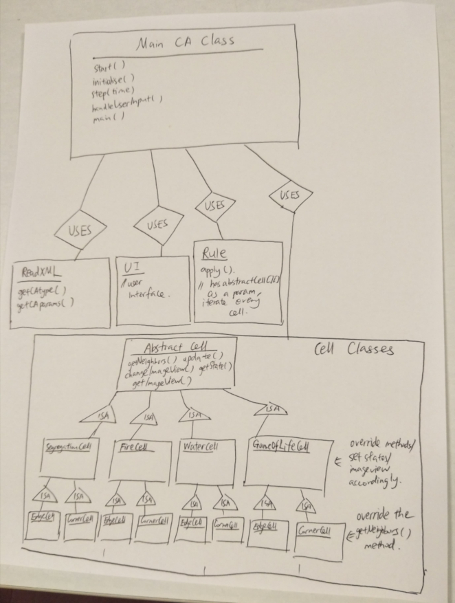
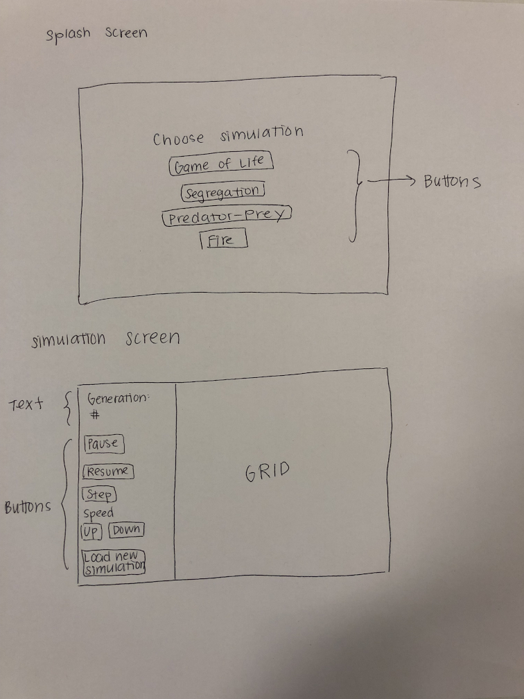

# Specification
Describe the primary classes (in packages if possible) you envision are needed to read in and represent a simulation.CA model and 
its simulation. Focus your design on how to represent a model in a general way and specifically on what behavior (i.e., 
methods) your classes would have. If describing an inheritance hierarchy, clearly identify what behaviors the classes have 
in common, the superclass, and what are different, the subclasses, rather than the instance variables.

Introduction
---
The objective of this project is to write a program that will implement several different Cell Automata (simulation.CA) models. 
The configuration details of the model will be defined in an XML file (written in the format determined by our team), and 
this file will be read in by the program. Depending on the information read in, the program will generate a simulation of 
a certain type (i.e. Game of Life, Spreading of Fire). A simulation type is identified by the set of rules it follows for 
updating the state of each cell in the grid for the next generation. The program will also allow visualization of this 
simulation by some interaction via user inputs through mouse and key. The goal of this program is that modifications and 
additions can be made to certain key features of the simulation. For example, the program should be flexible enough that 
either an entire new simulation type can be added to the code or individual elements such as new rules or new states can 
be added to existing simulation types. In terms of the primary architecture of the design, the architecture will be open 
to modifications so that a new simulation.CA model can be readily added by adding a new XML file and new subclass(es) implementing 
the abstract class that already exists for all simulation types. Behavior can be extended by creating these new 
subclasses, but the structure and scope of these new subclasses will be limited by the closed abstract superclass. This 
abstract class, as well as the main program involving visualizing the simulations, should stay unchanged as much as possible 
when adding a new type of simulation to the program.

Overview
--------
The classes and their relationships are illustrated in the picture below.

As shown in the picture above, this program will be divided into 5 parent classes: simulation.CA (main class), ReadXML, UI, Rule, 
and AbstractCell. This last class will be an abstract class with several subclasses. The inheritance hierarchy, which is 
also diagrammed above, will consist of four subclasses directly extending AbstractCell. Each of these subclasses will 
represent a typical (middle) cell in each of the four simulations we are going to implement: GameOfLifeCell, 
SegregationCell, FireCell, and WatorCell. Each of these subclasses will then have two more subclasses extending it, for 
example, WatorEdgeCell and WatorCornerCell. The reason that the program is structured this way is so that the 
simulation-specific rules, parameters, and states can be interpreted directly by every cell in the grid. 

The simulation.CA main class will be responsible for reading the appropriate XML file, initializing the cell grid and user 
interface, launching the animation, and stepping through the simulation. To achieve this functionality, it will require 
the following methods: main (to launch the start method), start (to set up the animation), initialize (a helper function 
to initialize all necessary simulation components), step (to update the simulation and animation), and handleUserInput 
(a helper function to interpret user input of mouse). As the main class, it will make use of all other classes in the 
program through the behavior within its methods. It will collaborate with the ReadXML class by using an object of this 
type to parse the necessary XML file within the simulation.CA’s start method. This will be done by accessing public methods within 
the ReadXML class. This will include two getter methods called getCAtype and getCAparams. There will be at least one 
other private method within ReadXML to help interact with the XML file that is passed into the constructor when this 
object is initialized. 

With this parsed data, the initialize method will then be called from simulation.CA’s start method. The behavior within this 
method may be divided into several helper methods to help keeps all methods short and single-purpose. Within the 
initialize method, the main class will collaborate with the AbstractCell class to initialize the grid, which will be a 
2D array of type AbstractCell[][]. Applying the concept of reflection, cells of all necessary types corresponding to 
the simulation type read in from the XML file will be initialized at each entry in AbstractCell[][]. For example, if 
determined that the simulation type is Wator, then this method will initialize each entry of the grid as either a 
WatorCell, WatorEdgeCell, or WatorCornerCell. This initialize method will also be responsible for adding the ImageView 
object corresponding to each cell to the root of the scene. An instance of the UI class and an instance of the class 
Rule will also be initialized here to be used later on by the simulation. 

Within the step function of simulation.CA, Rule’s public apply method will be called to update all elements in the grid 
AbstractCell[][]. Rule will have an instance variable of type AbstractCell[][] so that it can iterate over the entire 
grid to determine the next state of each cell, then update all of the elements in AbstractCell[][]. Both the 
determination of a cell’s next state and the update of its current state will be done by calling methods on each 
AbstractCell. Each subclass of this abstract class will have its own version of the methods updateNextState 
depending on the rules of the simulation and how the current state and neighbors are to influence what the next state 
becomes. This method within each cell subclass will make use of the private helper method getNeighbors, which will 
return a collection of all neighboring cells, again depending on the simulation’s definition of a neighbor. As mentioned 
above, the design of this structure allows the differences between simulations to be encapsulated in the cell subclasses, 
so that the rest of the program can continue function as needed without having to adjust or pay attention to the 
differences between the simulations. Once the states of each cell in the next generation have been determined, Rule’s 
apply method will call updateState on each cell, a public method that will include a helper method to change the 
ImageView instance variable of each cell so that the visualization can also be updated. These ImageView objects will 
then be added to the scene using public getter methods. 

As another component of the step function, several methods on the UI object mentioned above will be called in order to 
update the screen. The handleUserInput method in simulation.CA will collaborate with this object to determine when changes to the 
simulation need to be made based on the user’s actions. Specific behavior within the UI class will be further described 
later in this design plan. 

User Interface
--------------

### Appearance & User Interaction

###### *Splash page*:
There will be a splash page with program options when the program is run. The user will have choices of simulation types 
which will appear as buttons. Clicking on one of buttons will start the animation with the corresponding XML file at a default 
speed.

###### *During simulation*:
The simulation screen will be created based on the dimension determined in the XML file. These dimensions will not be 
changeable once the simulation has started. On the simulation screen, as the simulation proceeds, there will also be buttons 
to Pause, Resume, and Step through the simulation. Pressing the Step button will advance the simulation to the next generation 
and remain paused there until another button is pressed. There will also be speed Up and Down buttons, which will alter 
the speed of the animation by incrementing or decrementing the current value of frames per second each time either button 
is pressed. There will be another button Load New Simulation which will stop the current simulation, and bring the user 
back to the splash page. Additionally, this screen will display the number of generations that the simulation has passed 
through since starting.

### Error Handling
If the selected simulation prompts the program to try to read a file that is empty or has bad data, the user will be 
alerted with an error message that pops up on the simulation screen. Because the user input is limited to clicking 
different buttons, there are no other issues with bad input data that we have to consider. If the user tries to increase 
or decrease the speed of the animation past certain bounds that have been decided within the program, the speed will no 
longer change in that direction when the buttons are pressed.

Design Details
--------------

### Drill Down on Class Components

* *simulation.CA (main class)*

    Where major behavior of the program is initiated from, including interpretation of the XML file, initialization and 
    visualisation of the cells, handling user inputs. It extends Application class from JavaFx and implements the start 
    method. It is responsible for creating the stage, scene and root for the program.

    It has the following methods:
    * start()
        * Creates splash scene with UI class
        * Reads in XML file
        * Contains type of simulation, dimensions of grid, constants like thresholds and initial states of the cells
        * Calls initialize method
        * Creates simulation scene
        * Sets transitions between scenes
        * Creates animation
    * initialize (*simulation type*)
        * Initializes grid as AbstractCell[][]
        * Initializes each cell inside the grid
        * Adds ImageView object of each cell to the root
        * Initialize Rule
        * Initialize UI
    * step (*time*)
        * Calls Rule.apply() to update all the elements in grid AbstractCell[][]
    * handleUserInput()
        * Collaborates with UI object to handle mouse input from user and pass data to UI in order to initiate
        correct response from program
    * main()
        * Launches the start method
        
    *Justification and Flexibility for Extension*
    * Though this main class handles the initiation of most major behavior of the entire program, the actual 
    specific logic behind this behavior is handled within the other classes
    * In most cases, the main class only needs to be able to initiate this behavior or needs to know the outcome of 
    this behavior
    * All intermediate steps that are more susceptible to potential modifications are handled elsewhere 

* *AbstractCell*

    AbstractCell has field parameters such as and int representing the state of the cell, an ImageView object to appear 
    in JavaFx scene, and two int to represent the index of the cell in the cell grid, and a AbstractCell[][] (the grid), 
    a double variable width and a double variable height, a Group JavaFx node root, an int called nextState representing 
    the next state of the cell (this variable is necessary because we want to change the states of all cells in one batch).

    It has the following methods:
    * public List<AbstractCell> getNeighbors ()
    * public void updateNextState ()
    * private void updateState ()
    * private void changeImageView (int state)
    * public int getState ()
    * public ImageView getImageView ()

    Each simulation will require the following 3 subclasses:

    * *SpecificCell extends AbstractCell*
        * Have specific int state variables. (such as FIRE = 1)
        * Have other specific variables such as energy of a shark.
        * Constants from XML need to be passed as parameters for the constructors (i.e. probCatch).
        * Implements the four abstract methods.

    * *EdgeSpecificCell extends SpecificCell*
        * Overrides the getNeighbors () method.
    * *CornerSpecificCell extends SpecificCell*
        * Overrides the getNeighbors () method.
        
    *Justification and Flexibility for Extension*
    * The benefits of the way these components will be used to handle simulation-specific requirements given in the 
    assignment allow changes to rules and simulations to be applied much more easily 
    * With all minimum behavior being enforced by the abstract superclass, additional subclasses can easily be added
    to incorporate entire new simulation models, without needing to modify how the other simulations are currently
    set up 
    * Flexibility to alter the way certain simulations apply rule logic to their cells, by either modifying the code
    within a particular existing subclass to affect only one simulation, or potentially added new, simulation-specific 
    behavior to only certain subclasses via new methods 
    * Dependencies on cell states, neighbor definitions, and update rules are divided into their respective subclasses

* *Rule*

    Rule is constructed after AbstractCell[][] is initialized. Has AbstractCell[][] as the field parameter. In method 
    public void apply(), iterate through every grid twice, first calling cell.updateNextScene() then cell.updateState() 
    on each one cell.
    
    *Justification and Flexibility for Extension*
    * The design of this component does not require any specific rule handling within any specific simulation
    * All that is required are the methods updateNextState(), updateState(), and getImageView(), which are all abstract
    methods within the AbstractCell superclass 
    * There is no dependency within this rule on the specifics of any one simulation, so no adjustments need to be made
    in order to apply rules and updates to new or modified simulation models 

* *ReadXML*

    This class will have a method to interact with the XML file and additional helper methods called getCAtype(), 
    getCAparams() which will return the related values parsed from the XML file. Its constructor will require an XML file.
    
    *Justification and Flexibility for Extension*
    * Structuring this component as an entity that is separate from the rest of program is a decision that is beneficial 
    for the flexibility of the interpretation and format of XML files
    * All that is required by other components of the program via the main simulation.CA class are the values of the simulation.CA type
    and other simulation.CA parameters as interpreted within the ReadXML class 
    * Allows format changes to the XML files being read in without needing to modify code in any other component 

* *UI*

    This class will have a splash page method which will be setting up the splash page with the 4 options (Game of Life, 
    Segregation, Predator-Prey and Fire). There will also be a method handling the transition between the splash page and 
    the simulation screen. In other ways, after the user clicks on one of the four buttons, the simulation screen will be 
    displayed accordingly. There will also be a method setting up the simulation screen. There will also be a method handling 
    user input in the simulation screen.
    
    *Justification and Flexibility for Extension*
    * Handling all user visualization and responding to all user input within one class separates this functionality 
    from potential changes to the rest of the program
    * From this class, all other classes only need to interact with the simulation scene and root 
    * From other classes, this class only needs to interact with the main class's capturing of user input (via the 
    handleUserInput method) and the types of simulations that are to be made available to the user 

### XML file example

The format of the XML files read in by the program will follow a structure like the example below. 
    
    <?xml version="1.0" encoding="UTF-8"?>
    <cell_society>
    <simulation>
    <name>Segregation</name>
    <tile>Segregation_1</title>
    <author>Team13</author>
    </simulation>
    <params>
    </params>
    <dim&config>
            <width>w</width>
            <height>h</height>
            <length>l<length>//length of the side of the cell
            <agentX>x</agentX>
            <agentO>o</agentO>
                         <empty>e</empty> //percentage x+o+e = 100
    </dim&config>
    </cell_society>

### Specific Use Cases
* *Apply the rules to a middle cell: set the next state of a cell to dead by counting its number of neighbors using the 
Game of Life rules for a cell in the middle (i.e., with all its neighbors)*

    Call updateNextState() method on a middle cell, which will update the instance variable nextState based on states from 
    the list of neighbors returned by getNeighbors().

* *Apply the rules to an edge cell: set the next state of a cell to live by counting its number of neighbors using the 
Game of Life rules for a cell on the edge (i.e., with some of its neighbors)*

    Call updateNextState() method on an edge cell, which will update the instance variable nextState based on the states 
    from the list of neighbors returned by getNeighbors()

* *Move to the next generation: update all cells in a simulation from their current state to their next state and display 
the result graphically*

    Rule.apply()  will iterate through the whole grid and call cell.updateNextState() on each cell. Rule.apply() will 
    iterate through the grid again, and call cell.updateState() on each cell. Each cell.update() besides changing the state 
    int variable, will implicitly call cell.changeImageView(int myState) to update (or add or remove) their ImageView objects 
    in root.
    
* *Set a simulation parameter: set the value of a parameter, probCatch, for a simulation, Fire, based on the value given 
in an XML fire*

    We have a class for reading XML file. After the value is read, it will be passed into the specific class for cell and 
    rule initialisation.

* *Switch simulations: use the GUI to change the current simulation from Game of Life to Wator*

    Press Load New Simulation to go back to splash page. If the user press the Water button on the screen, a new screen 
    and a new root will be created and Water will be initialised and simulated. Each time a new root is created, a new 
    AbstractCell[][] grid is created.

Design Considerations
---------------------
Several issues were discussed during the planning of this project’s design. These are explained below.

* *Creating a class for cell state*

	We noticed that within each simulation type and its specific set of rules, there were many dependencies between data 
	and behavior, and the type of state. For example, in the Wa-Tor simulation model, the rules that are applied to a cell 
	in the Shark state are different than the rules applied to a cell in the Fish state, but it’s possible to view one set 
	of rules a subset of the other. Therefore, if there was some abstract superclass state that had a subclass for each 
	type of state with a different set of rules within each simulation, this might enable us to determine cell state 
	updates in an easier way. However, we decided that there were more important ways to categorize cells. We ultimately 
	decided to have a subclass per cell position (middle, corner, edge) instead for each type of simulation. Since the 
	state can be represented in a very simple way (with an integer representation), it makes more sense for the state 
	to be an instance variable for each cell type. Then, the behavior that is defined by the rules can be determined in 
	other methods within the cell subclasses of each simulation model.

* *Whether to include neighbours of a cell inside the Cell Class or calculate a cell’s neighbours when they are needed 
from the Rule Class*

    If we write the getNeighbours method inside the Cell Class, it is easier for us to call cell.getNeighbours() in the 
    Rule Class for updates. However, this will require the Cell Class to know where itself is in the grid. This can be 
    achieved by either using location variables or passing into the Cell Class the whole grid. The latter one might be 
    very troublesome and waste memory. We also considered the option of calculating the cell’s neighbours when we need 
    them in the Rule Class. For this one, we have the whole grid so we know where each cell is.

* *Putting Rule Logic in SpecificRule Subclass vs. in SpecificCell Subclass*

	Once we had determined the inheritance hierarchy of the AbstractCell superclass, we faced a problem with redundancy 
	in terms of how the rules would be applied. If the simulation-specific rules were applied in the method Rule.apply(), 
	then this would require several subclasses within the Rule class for each type of simulation. A benefit of this would 
	e that simulation-specific parameters (such as fish reproduction cycle in Wa-Tor) would only have to be stored in one 
	Rule subclass, instead of storing them in every instance of a SpecificCell subclass. However, to reduce this idea of 
	redundancy and reduce the amount of information that the Rule class needs to know about how to apply the rules, we 
	decided that it was a better design choice to keep the simulation-specific data and behavior in the subclasses of 
	AbstractCell.

* *How to Read in Simulation-Specific Variables and Constants from the XML File*

	There are several variables that we might need to parse from the XML file depending on the type of simulation. 
	For example, there is the threshold t in the Segregation simulation, the probability probCatch in the Fire simulation, 
	and several reproduction-energy related variables in the Wator simulation. We have to decide whether these variables 
	can be read in at runtime in order to create static variables within the WatorCell. This would prevent the WatorCell 
	from having repetitive field variables. For example, static DYINGTHRESHOLD for WatorCell instead of dyingThreshold 
	for new WatorCell().

* *Instantiate a Class by Name with Reflection*

    We considered using reflection so that, for example, when we read the XML file and decide the simulation type is 
    Wator, we can let simulation.CA instantiate specifically a WatorCell instead of other kinds of cells. Although it might be a 
    challenge to figure out how to use the unfamiliar concept of reflection here, it may be a worthwhile decision in 
    order to allow for this flexibility in the code. [StackOverflow article for reference](https://stackoverflow.com/questions/9886266/is-there-a-way-to-instantiate-a-class-by-name-in-java)

Team Responsibilities
---------------------

This section describes the program components each team member plans to take primary and secondary responsibility for 
and a high-level plan of how the team will complete the program.

* simulation.CA: A main class to run simulation from

    Haotian, Julia, Yunhao

* ReadXML: A class for reading XML file (DOM)

    Yunhao
* AbstractCell: A class for individual cell that has parameter such as its states.

    Julia, Haotian
* SpecificCellA and their edge, corner subclasses:

    Haotian
* SpecificCellB and their edge, corner subclasses:

    Julia
* SpecificCellC and their edge, corner subclasses:

    Yunhao
* SpecificCellD and their edge, corner subclasses:

    Haotian
* Rule: A class for rule that calls cells to update to next generation.

    Julia, Yunhao
* UI: A class for interfaces

    Haotian, Yunhao, Julia

Every evening, we would discuss what we have done. We will meet once before Friday and once on weekends. We will meet 
more often in person or online if we encounter problems. Priority will be to build abstract parent classes first.
